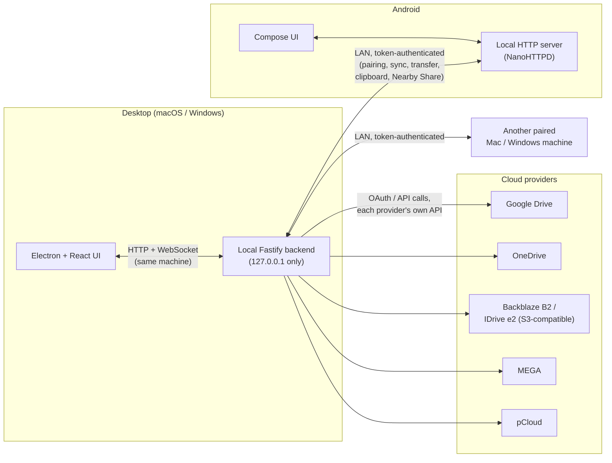

# Architecture overview

```
apps/
  backend/    Fastify server — the real brain. Talks to every cloud provider and every
              paired device, handles sync, trash, search, pairing. Runs locally, never
              leaves the machine it's on.
  desktop/    Electron + React. The macOS/Windows app — a UI shell around the local
              backend, plus native bits: tray, USB pairing, lock screen, Share Extension.
  android/    Kotlin + Jetpack Compose. The phone app — its own local HTTP server so a
              paired desktop can browse/push to it, plus background workers for sync and
              camera backup.
  website/    Astro static site (apps/website) — builds to static HTML/CSS/JS, no backend/server.
packages/
  shared/     TypeScript types shared between backend and desktop.
```

The backend is the single source of truth for a desktop install. The desktop React app is a window
onto it (same-machine HTTP + a WebSocket for live events); the phone talks to a paired desktop's
backend directly over the LAN once paired, and separately runs its own tiny local HTTP server so the
reverse direction (desktop browsing the phone) works too.

## No central relay server — still accurate as of v2.8.9

Every cloud call (Google Drive, OneDrive, B2, IDrive e2, MEGA, pCloud) goes straight from the backend
running on your machine to that provider's own API, using OAuth/API credentials you supplied. Every
device-to-device feature (pairing, sync, file transfer, Nearby Share, clipboard, remote unlock) is a
direct LAN connection between two AllieMinate installs. There is no AllieMinate-operated server that
any of this traffic passes through, because none exists — this project has no backend infrastructure
of its own beyond what runs locally on your devices.

## Diagram



Nothing in this diagram routes through project-operated infrastructure — every arrow is either
"this machine to a cloud provider's own API" or "this machine to another of your own devices, direct
over LAN."

## Data flow: adding a Google Drive file to a Sync Pair

1. The desktop backend's file watcher (`chokidar`) detects a new/changed file in the local folder.
2. It's checked against the Sync Pair's ignore rules (`sync/ignoreRules.ts`).
3. The backend computes a content hash (MD5, streamed — `sync/fileHash.ts`) and compares it against
   the last-known state for that path.
4. If it's a real change, the backend uploads it to the destination via that provider's own SDK
   (`storage/GoogleDriveBackend.ts`, etc.) — the request goes straight from this machine to Google's
   API.
5. The reconciliation result (including any conflict handling —
   [../getting-started/sync-configuration.md](../getting-started/sync-configuration.md)) is persisted
   to a local JSON sync-state store and broadcast over the local WebSocket so the UI updates live.
6. If the same folder is also a Universal Sync Folder, the same event triggers a push to every other
   granted peer device over its own paired LAN connection — cloud upload and peer push happen
   independently, not chained through each other.

## Security model

See [security-model.md](security-model.md) for the full breakdown of what pairing tokens do and don't
protect against, and how App Lock/destructive-action authentication work.

## Build & release process

See [build-and-release.md](build-and-release.md) for exactly how the `.dmg`/`.exe`/`.apk` are built
today (all manual, no CI-produced installers yet).
